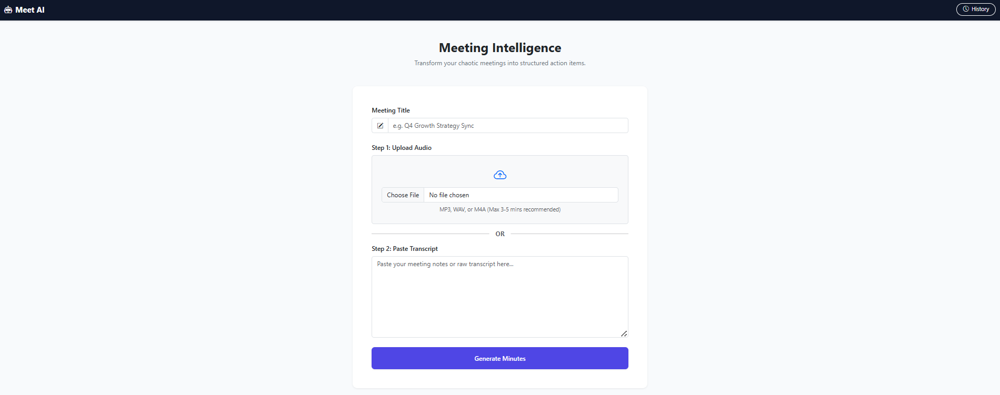
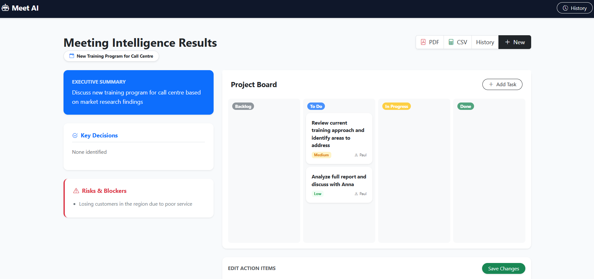
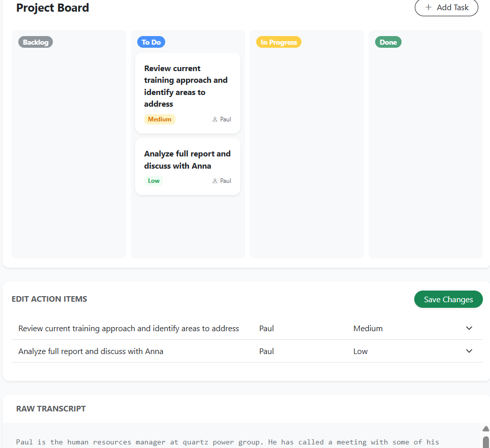
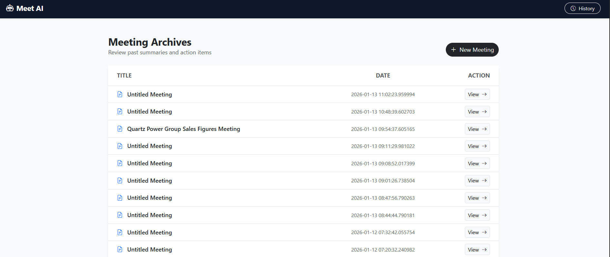

# MeetAI   
It is an AI-powered meeting assistant that converts meeting **audio recordings** (or pasted transcripts) into structured meeting minutes with actionable tasks.  
It runs **locally** using **Whisper (Speech-to-Text)** and **Ollama LLM (Llama 3 / Llama 3.2)**.

> ✅ Audio → Transcript → Summary + Decisions + Action Items  
> ✅ Editable tasks + Trello-style Kanban board  
> ✅ PDF + CSV export + meeting history

---

## Screenshots / Demo

### Home Page
<!-- Replace with your screenshot -->


### Result Page (Minutes + Editable Table)
<!-- Replace with your screenshot -->


### Kanban Board (Drag & Drop)
<!-- Replace with your screenshot -->


### History Page
<!-- Replace with your screenshot -->


---

## Features

### Meeting Minutes Extraction
- Upload **audio** OR paste **meeting transcript**
- Automatically generates:
  - Summary
  - Decisions
  - Risks / Blockers
  - Action Items

### Smart Action Items
Each extracted task includes:
- Task description
- Owner
- Due date (supports relative date resolution)
- Priority (Low / Medium / High)
- Confidence score
- Status

### Editable Action Items Table
- Edit task details directly
- Save changes back to database

### Trello-Style Kanban Board
- Drag & drop tasks across columns:
  - Backlog
  - To Do
  - In Progress
  - Done
- Status updates auto-save (API based)

### Export Options
- Export meeting minutes as **PDF**
- Export tasks as **CSV**

### Meeting History
- All meetings stored in SQLite
- History page listing all processed meetings

---

## Tech Stack

- **Backend:** Flask (Python)
- **Database:** SQLite + SQLAlchemy
- **AI (Offline):**
  - Whisper (Speech-to-Text)
  - Ollama LLM (Llama 3 / Llama 3.2)
- **Frontend:** Bootstrap 5 + Jinja2 Templates
- **Kanban Drag-Drop:** Vanilla JavaScript

---

## Project Structure

```text
Meetai/
│
├── run.py
├── requirements.txt
├── .env
│
├── app/
│   ├── __init__.py
│   ├── routes.py
│   ├── models.py
│   └── utils/
│       ├── llm_extractor.py
│       ├── whisper_transcriber.py
│       ├── schema.py
│       ├── date_resolver.py
│       ├── export_utils.py
│       └── text_cleaner.py
│
├── templates/
│   ├── base.html
│   ├── index.html
│   ├── result.html
│   └── history.html
│
├── static/
│   └── board.js
│
├── uploads/
├── exports/
└── instance/
    └── database.db
```

---

## Setup & Installation

###  Clone the repository
```bash
git clone https://github.com/22f3000586/Meetai.git
cd Meetai
```
 Create and activate virtual environment

Windows
```bash
python -m venv venv
venv\Scripts\activate
```

Install dependencies
```bash
pip install -r requirements.txt
```
Install Ollama
Download: https://ollama.com/

Pull LLM model
```bash
ollama pull llama3
```

(Alternative model)
```bash
ollama pull llama3.2:3b
```
Run the model (keep running in background)
```bash
ollama run llama3
```
▶️ Run the App
```bash
python run.py
```

Open in browser:
```bash
http://127.0.0.1:5000
```
Contributions are welcome! If you have suggestions for new features or UI improvements, feel free to open an issue or submit a pull request.
